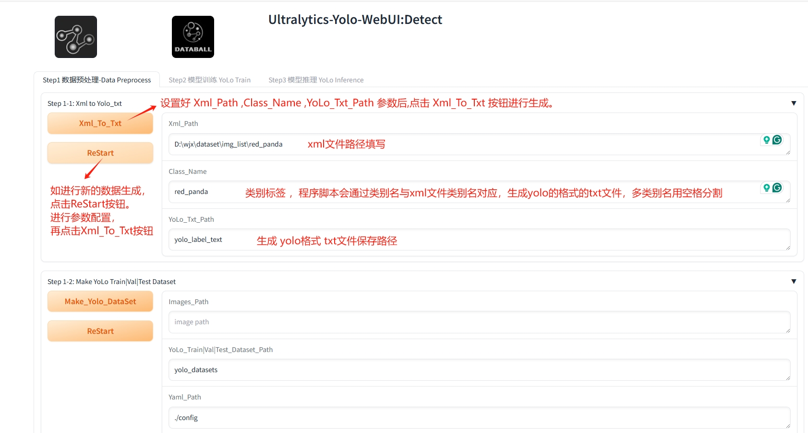
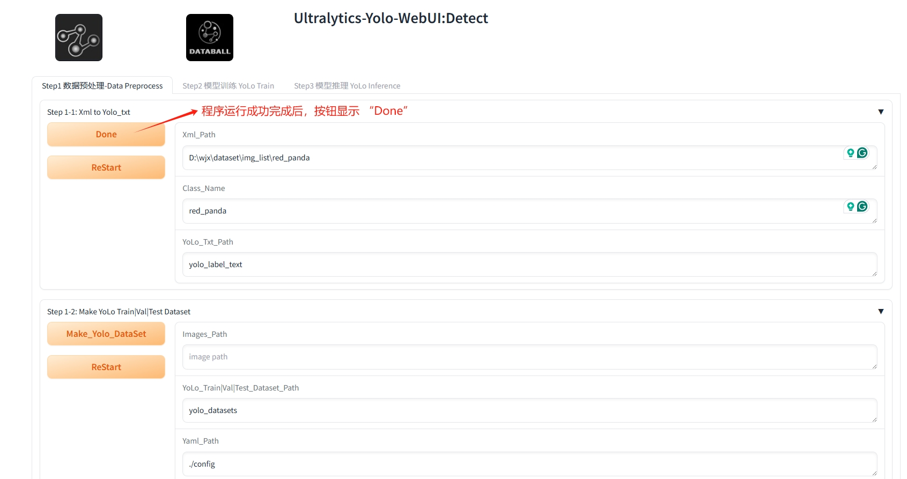
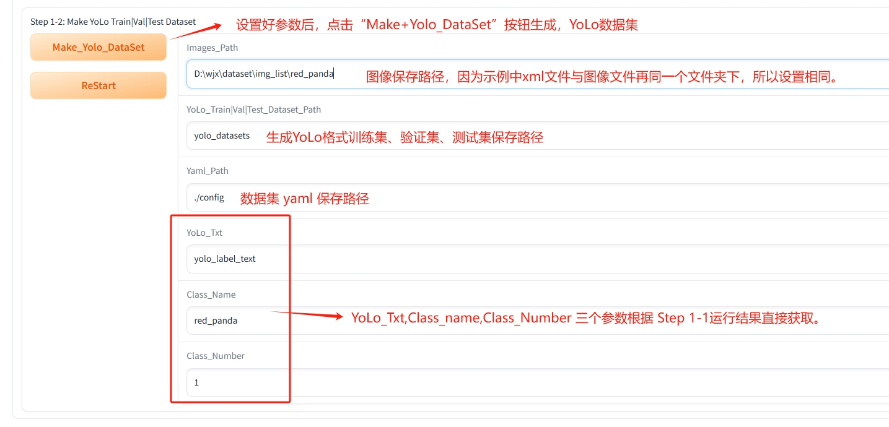
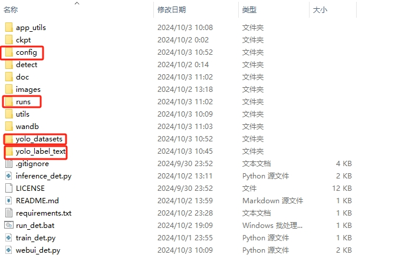
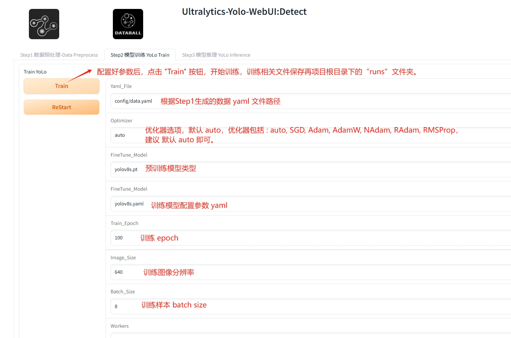
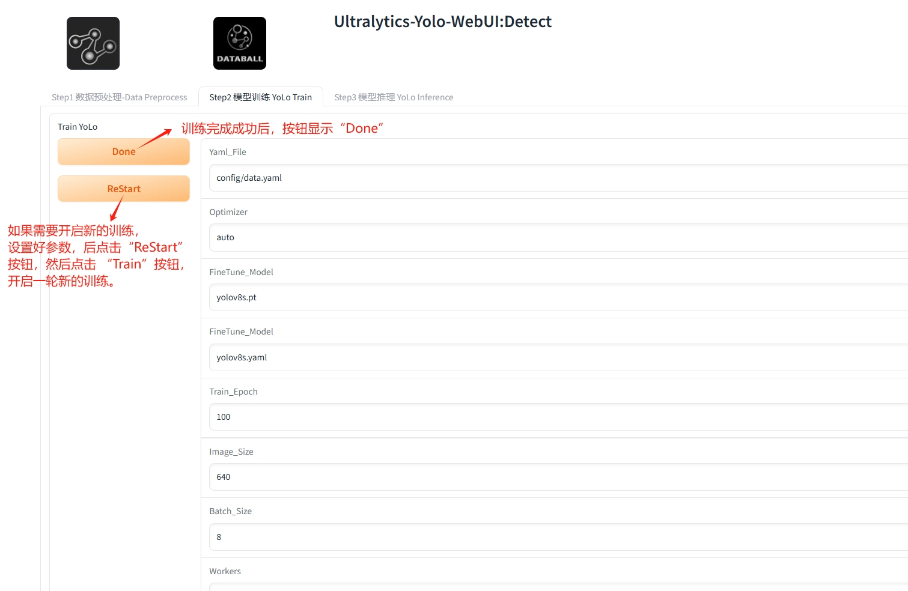
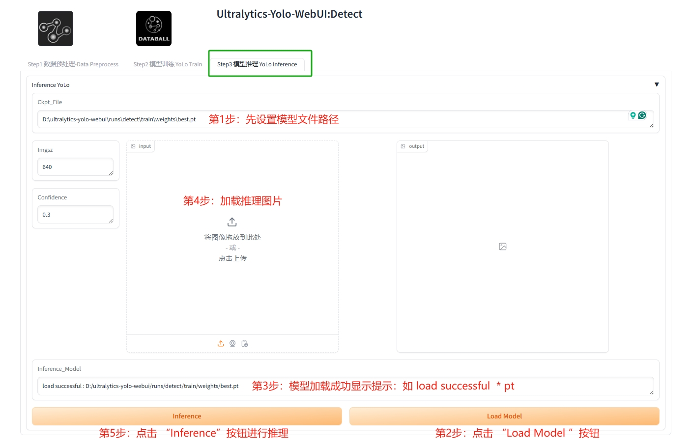
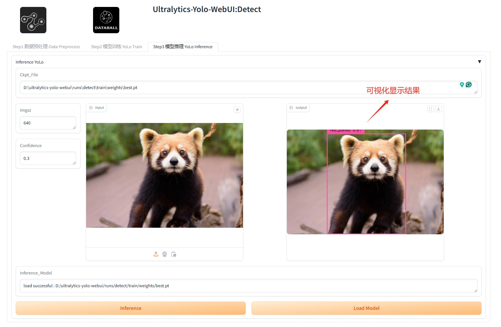

# ultralytics-yolo-webui
ultralytics-yolo-webui : DataBall

## 更多的项目数据资源和落地方案，可以加入 “DataBall - X ”知识星球 free


## 工具使用视频演示

[1.yolo webui工具-数据预处理：xml转txt](https://www.bilibili.com/video/BV1AdSJBnE5w?vd_source=6f20800acf917d7acba11482f3414e33&spm_id_from=333.788.videopod.sections)

[2.yolo webui工具-生成yolo格式训练集及配置文件](https://www.bilibili.com/video/BV1T2SJB4Ek1?vd_source=6f20800acf917d7acba11482f3414e33&spm_id_from=333.788.videopod.sections)

[3.yolo webui工具-模型训练](https://www.bilibili.com/video/BV1KDSJB9EGq?vd_source=6f20800acf917d7acba11482f3414e33&spm_id_from=333.788.videopod.sections)

[4.yolo webui工具-模型推理](https://www.bilibili.com/video/BV1qGSwBdEfE?vd_source=6f20800acf917d7acba11482f3414e33&spm_id_from=333.788.videopod.sections)

## 1、Install

```python
pip install -r requirements.txt
```
## 2、Quick Start
### 2.1 Detect(目标检测)
#### * Data Preprocess (数据预处理)

##### [该项目用到的示例数据下载地址(百度网盘 Password: 9aez )](https://pan.baidu.com/s/11ftllkFOUTsOfihQF0n9mg)  

    

    

    

   

##### 生成对应的文件夹



#### * Train YoLo(训练)


   

#### * Inference YoLo(推理)
   

   

```python
python webui_det.py
```

```bash
run_det.bat
```

## 3.Thanks (特别感谢)

[ultralytics](https://github.com/ultralytics/ultralytics)  

## 4.Contact(联系方式)  
* E-mails: 305141918@qq.com   
<br>
* WeChat:
<br>

* <br>
<br><br><br><br><br><br>
* DataBall (Technology group):
<br>
* <br>
